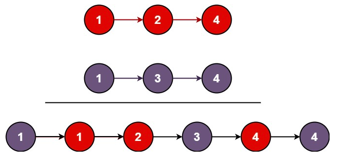

# Merge Two Sorted Lists

You are given the heads of two sorted [linked lists](https://www.geeksforgeeks.org/what-is-linked-list) `list1` and `list2`.

Merge the two lists into one __sorted__ list. The list should be made by splicing together the nodes of the first two lists.

Return *the head of the merged linked list.*


**Example 1:** \
 \
__Input:__ ```list1 = [1, 2, 4], list2 = [1, 3, 4]```\
__Output:__ ```[1, 1, 2, 3, 4, 4]```

**Example 2:** \
__Input:__ ```list1 = [], list2 = []```\
__Output:__ ```[]```

**Example 3:** \
__Input:__ ```list1 = [], list2 = [0]```\
__Output:__ ```[0]```


**Constraints:**
* ```The number of nodes in both lists is in the range [0, 50]```
* ```-100 <= Node.val <= 100```
* ```Both list1 and list2 are sorted in non-decreasing order```
