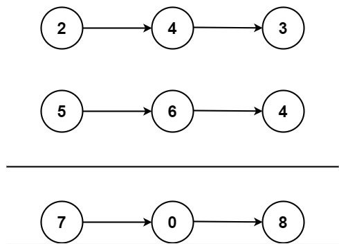

# Add Two Numbers

You are given two **non-empty** linked lists representing two non-negative integers. The digits are stored in **reverse order**, and each of their nodes contains a single digit. Add the two numbers and return the sum as a linked list.

You may assume the two numbers do not contain any leading zero, except the number 0 itself.

**Example 1:**\
\
__Input:__ ```l1 = [2,4,3], l2 = [5,6,4]```\
__Output:__ ```[7,0,8]```\
__Explanation:__ ```342 + 465 = 807.```

**Example 2:**\
__Input:__ ```l1 = [0], l2 = [0]```\
__Output:__ ```[0]```

**Example 2:**\
__Input:__ ```l1 = [9,9,9,9,9,9,9], l2 = [9,9,9,9]```\
__Output:__ ```[8,9,9,9,0,0,0,1]```

**Constraints**
* The number of nodes in each linked list is in the range ```[1,100]```
* ```0 <= Node.val <= 9```
* It is guaranteed that the list represents a number that does not have leading zeros
